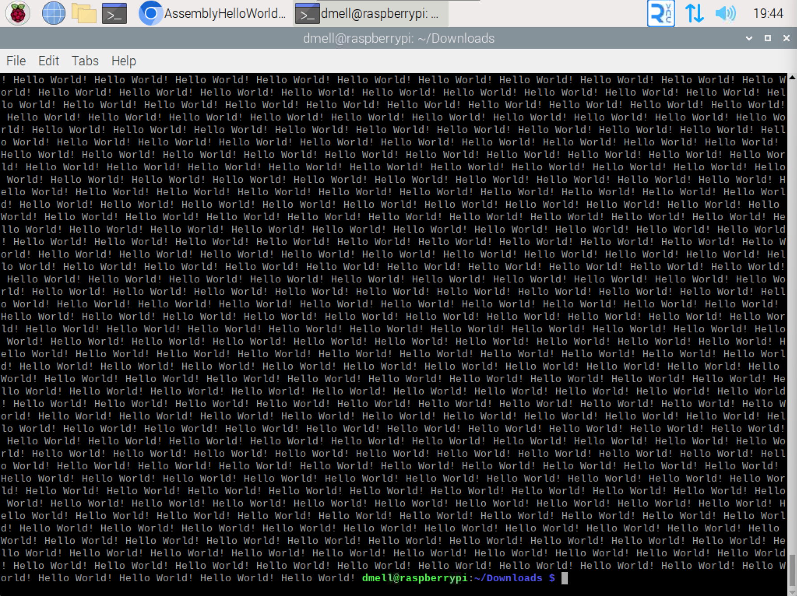

# Hello World Spam in ARM Assembly
Spams Hello World 100,000 times.

Tested on the 32-bit Raspberry Pi 2B.

## Why?
I wanted to build a program to tie all of my Assembly knowledge together.
This program uses:
- Conditionals
- Branches
- Loops
- The Stack
- Memory storage
- Labels
- String output

## Usage
1. Assemble file: `as main.s -o main.o`
2. Create executable `binary: ld main.o -o main`
3. Run file: `./main`
